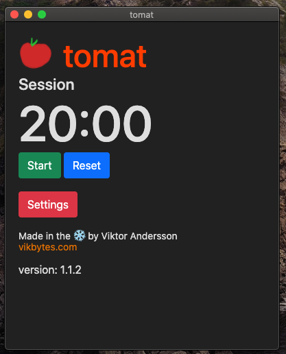
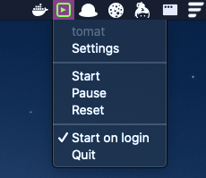

<h1 align="center">tomat </h1>
<p>
  <a href="#" target="_blank">
    
  </a>
  <a href="https://twitter.com/vikbytes" target="_blank">
    
  </a>
</p>
[![NPM Version][npm-image]][npm-url]

> A pomodoro style productivity timer.

## Screenshots



## Releases
Current release binaries are available under Releases.

## Compile yourself
Make sure you have npm installed.

```
npm install
```

Depending on your platform you want to use the corresponding flag: **m**ac, **w**indows or **l**inux.
```
electron-builder -mwl
```

## Author

👤 **vikbytes**

* Website: https://www.vikbytes.com
* Twitter: [@vikbytes](https://twitter.com/vikbytes)
* Github: [@vikbytes](https://github.com/vikbytes)

[npm-image]: https://img.shields.io/npm/v/datadog-metrics.svg?style=flat-square
[npm-url]: https://npmjs.org/package/datadog-metrics