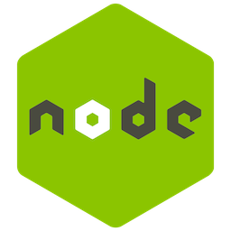

<h1 align="center">tomat</h1>

  

> A pomodoro style productivity timer.

## Screenshots

## Releases
Current release binaries are available under Releases.

## Compile yourself
Make sure you have npm installed.
- `npm install` install dependencies
- `electron-builder -mwl` with corresponding flag for your platform
m for Mac, w for Windows, and l for Linux.
Your build will end up in the dist folder.

## Built with

## Contact
* Website: [homepage](https://www.vikbytes.com)
* Twitter: [@vikbytes](https://twitter.com/vikbytes)